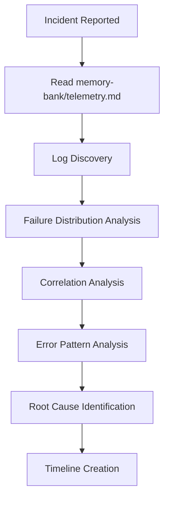

# Purpose

Systematic methodology for investigating incidents using logs in Azure Data Explorer (ADX). This guide provides a step-by-step workflow approach to become an expert investigator by following proven investigation phases and decision points.

**CRITICAL FIRST STEP: Always read `memory-bank/telemetry.md` before starting any investigation.** This file contains service-specific context, table schemas, query patterns, and investigation techniques that are essential for effective troubleshooting.

# Investigation Framework



# Phase 1: Log Discovery

## Log Investigation Process

**For detailed log querying instructions, see `memory-bank/telemetry.md`**

**Mandatory Tooling**: Use `azure-mcp/kusto` MCP tool when running any ADX/Kusto queries as part of Log Discovery.


### Key Steps:
1. **Connect to appropriate cluster/database**
2. **Identify relevant tables** for the incident type
3. **Examine table schemas** to understand available columns
4. **Discover dimension values** using broad queries
5. **Apply scoping filters** based on incident context
6. **Validate correlation fields** for tracing operations

### Important Principles:
- **Always scope to relevant data** - tables are typically multi-tenant
- **Use `has` operator** for initial discovery, then `==` for precise filtering
- **Start broad, then narrow down** your investigation scope

# Phase 2: Failure Distribution Analysis

## Critical Foundation: Understanding the Blast Radius

**Before diving into root cause analysis, you must understand HOW BROAD the issue is.**

This phase answers the fundamental question: "What is the distribution pattern of this failure?" Understanding the scope helps distinguish between different types of issues and guides your investigation strategy.

## MANDATORY: Customer Impact Assessment

**Customer impact assessment is CRITICAL and must be part of every failure distribution analysis.** In addition to understanding the technical distribution pattern, you must quantify the actual customer impact.

### Why Customer Impact is Essential:
- **Distinguishes service issues from customer issues**: Internal service degradation doesn't always equal customer impact
- **Provides accurate business impact**: Determines incident severity and response urgency
- **Guides communication strategy**: Informs stakeholder updates and customer notifications
- **Validates service protection mechanisms**: Confirms if throttling/circuit breakers are working as designed

### How to Calculate Customer Impact:
For detailed instructions on correctly calculating customer impact, see `memory-bank/telemetry.md`.

**Key Principles for Customer Impact Assessment:**
- ✅ **Use failed requests (`success == "False"`)** from lsa_requests table - this represents actual customer impact
- ❌ **Do NOT use exceptions or traces** to count customer impact - these contain internal retries and diagnostics
- ✅ **Analyze subscription-level impact** using customDimensions.AlertRuleSubscriptionId
- ✅ **Compare baseline vs incident periods** to understand impact magnitude
- ✅ **Assess service success rates** to quantify degradation level

**Customer Impact Questions to Answer:**
- How many unique subscriptions are actually impacted?
- How many failed requests represent actual customer-facing failures?
- What is the service success rate degradation during the incident?
- Are there alert volume spikes that might have triggered protection mechanisms?
- Which regions have actual customer impact vs. internal service issues?

## Key Distribution Questions

### 1. Infrastructure Distribution
- **Host Level**: Does this affect all hosts, single host, or specific hosts?
- **Instance Level**: All instances vs single instance vs subset of instances?
- **Node Distribution**: Across all nodes or isolated to specific nodes?
- **Geographic**: All regions, single region, specific data centers?

### 2. Resource/Dependency Distribution
- **Storage Dependencies**: 
  - Blob storage: All accounts vs single account?
  - Which storage nodes are affected?
- **EventHub/ServiceBus**: 
  - All partitions vs specific partitions?
  - Which namespace/topic is affected?
- **Database Dependencies**: All databases vs specific databases?
- **Network Dependencies**: All connections vs specific endpoints?

### 3. Logical Distribution
- **Tenant/Service Level**: All tenants vs specific tenants?
- **Feature Level**: All features vs specific functionality?
- **Code Path Level**: All code paths vs specific operations?

### 4. Temporal Distribution
- **Continuous vs Intermittent**: Is the failure constant or sporadic?
- **Time-based Patterns**: Does it correlate with specific times/loads?
- **Progression**: Is it spreading or contained?

## Pattern Recognition Framework

### Distribution Patterns and Their Implications

| Pattern | Likely Cause | Investigation Focus |
|---------|--------------|-------------------|
| **All instances affected equally** | Code bug, configuration change, global dependency failure | Recent deployments, config changes, global services |
| **Single instance/host affected** | Hardware issue, local resource problem, instance-specific corruption | Host health, local resources, instance logs |
| **Subset of instances affected** | Partial rollout, A/B testing, load balancer issue | Deployment strategy, traffic routing, feature flags |
| **Single partition/resource affected** | Resource-specific issue, data corruption, localized failure | Resource health, data integrity, resource-specific logs |
| **Geographic pattern** | Regional outage, network issue, data center problem | Regional services, network connectivity, infrastructure status |
| **Time-based pattern** | Load-related, scheduled operations, external dependencies | Load patterns, scheduled jobs, external service status |

## Decision Tree for Investigation Strategy

```kql
// Step 1: Quick distribution assessment
{tableName}
| where Level == "Error" and TIMESTAMP > ago(30m)
| where {your_scoping_filters}
| summarize 
    TotalErrors = count(),
    AffectedInstances = dcount(cloud_RoleInstance),
    TotalInstances = dcount(cloud_RoleInstance),
    ErrorPatterns = make_set(extract(@"Exception: (\w+)", 1, message), 5)
| extend 
    InstanceCoverage = (AffectedInstances * 100.0) / TotalInstances,
    InvestigationStrategy = case(
        InstanceCoverage > 80, "GLOBAL_ISSUE",
        InstanceCoverage > 20, "PARTIAL_ISSUE", 
        InstanceCoverage > 5, "LOCALIZED_ISSUE",
        "ISOLATED_ISSUE"
    )
```

### Investigation Strategy Based on Distribution

**GLOBAL_ISSUE (>80% affected)**
- Focus on: Recent deployments, global configuration changes, upstream dependencies
- Priority: Rollback plans, global service health checks

**PARTIAL_ISSUE (20-80% affected)**
- Focus on: Partial rollouts, load balancer configuration, A/B testing
- Priority: Traffic routing, deployment rings, feature toggles

**LOCALIZED_ISSUE (5-20% affected)**
- Focus on: Specific resource failures, regional issues, subset configuration
- Priority: Resource health, regional services, specific tenant issues

**ISOLATED_ISSUE (<5% affected)**
- Focus on: Instance-specific problems, data corruption, edge cases
- Priority: Instance logs, data integrity, specific user scenarios

## Integration with Subsequent Phases

Understanding distribution informs:
- **Correlation Analysis**: Which correlation IDs to focus on
- **Error Pattern Analysis**: Expected vs unexpected error patterns
- **Root Cause Analysis**: Where to look for the root cause
- **Impact Assessment**: Business impact and urgency level

## Key Success Criteria

Before moving to correlation analysis, you should be able to answer:
1. **Scope**: How many instances/resources/tenants are affected?
2. **Pattern**: Is there a clear pattern to what's affected vs what's not?
3. **Stability**: Is the issue spreading, stable, or resolving?
4. **Type**: Does this look like infrastructure, code, or dependency issue?

# Phase 3: Correlation Analysis

## Purpose

Correlation analysis traces related events through the system to understand the complete flow of a failing operation.

## Key Steps

**For detailed correlation techniques, see `memory-bank/telemetry.md`**

### 1. Identify Correlation Fields
Common correlation candidates:
- `operation_Id`, `operation_ParentId`
- `correlationId`, `trackingId`
- `traceId`, `spanId`
- Custom correlation identifiers

### 2. Validate Correlation Quality

**Good correlation indicators:**
- Messages form logical sequence
- Reasonable time span
- Clear start/end points
- Related operations across components

**Poor correlation indicators:**
- Random unrelated messages
- Excessive time spans
- No logical flow pattern

### 3. Trace Complete Operations

Use validated correlation IDs to trace the full request flow across:
- Request initiation
- Dependency calls
- Processing steps
- Error points
- Completion or failure

## Success Criteria

Before proceeding, ensure you can:
- Trace a complete operation from start to finish
- Identify where in the flow failures occur
- Understand the sequence of events leading to errors

# Phase 4: Error Pattern Analysis

## Purpose

Error pattern analysis identifies and categorizes error messages to understand failure modes and their frequency.

**For detailed error analysis techniques, see `memory-bank/telemetry.md`**

## Key Steps

### 1. Identify Error Indicators

### Common Error Level Candidates

- `Level`
- `traceLevel`
- `errorLevel`
- `severity`
- `logLevel`

### Discovery Process
    - we must verify what is the write level of the dimension we choose, so we take a saple for each dimension value. we can use short time range period, as we just want to understand the schema.
    once we have the vlues, we can understand by the message, what is the dimension value which indicates the an error/failure warning, info etc, 
    like in the query below.

```kql
// Discover available log levels
{tableName}
// | some datetime filter, we can look on the last hour
// | some scope fileter
| summarize take_any(message) by Level

// Examine error messages
{tableName}
// | some datetime filter, we can look on the last hour
// | some scope fileter
| where Level == "{errorLevel}" // whatever we got and understood, from the previous query
| take 10
| project TIMESTAMP, Level, message
```

    Now we know which dimesnions and value indicates a filure, use this knowledge
    - when working on failures messages, or messages in general, use small samples, if you need to see the messge it self, as they can be big texts.
    - if you need raw message, take very few samples (<5) to learn from (it is very expensive)
    - project only the columns you really need.
    - try to alwyas apply summarize logic, with patterns, like below.

## Step 2: Extract Error Patterns

### Basic Pattern Extraction

```kql
{tableName}
// | some datetime filter, we can look on the last hour
// | some scope fileter
| where Level == "{errorLevel}"
| extend ErrorType = case(
    message contains "timeout", "Timeout",
    message contains "connection", "Connection",
    message contains "null reference", "NullReference",
    message contains "exception", "Exception",
    "Other"
)
| summarize Count = count() by ErrorType, bin(TIMESTAMP, 5m)
```

### Advanced Pattern Extraction

```kql
// Use regex for sophisticated pattern extraction
{tableName}
// | some datetime filter, we can look on the last hour
// | some scope fileter
| where Level == "{errorLevel}"
| extend ErrorPattern = extract(@"Exception: (\w+)", 1, message)
| extend ErrorMethod = extract(@"at (.+?)\(", 1, message)
| summarize Count = count() by ErrorPattern, ErrorMethod, bin(TIMESTAMP, 5m)
```

## Step 3: Identify New vs Existing Errors

```kql
// Compare error patterns before and during incident
let incident_start = datetime(2025-05-23 03:10:16);
{tableName}
// | some datetime filter, we can look on the last hour
// | some scope fileter
| where Level == "{errorLevel}"
| extend Period = iff(TIMESTAMP < incident_start, "Before", "During")
| extend ErrorPattern = extract(@"Exception: (\w+)", 1, message)
| summarize Count = count() by ErrorPattern, Period
| evaluate pivot(Period, sum(Count))
| where During > 0 and (isnull(Before) or Before == 0) // New errors only
```

# Critical Thinking Framework for Root Cause Analysis

## Purpose

Before concluding any root cause, you must validate your hypothesis with evidence. This framework ensures you don't jump to conclusions prematurely and that your findings are backed by data.

## Core Principles

### 1. Declare Your Hypothesis Explicitly

- State clearly what you believe is happening
- Identify what evidence would support or refute your hypothesis
- Consider alternative explanations before proceeding

### 2. Validate Through Temporal Correlation

**Key Question: Does the suspected cause align with the incident timeline?**

- Compare behavior BEFORE the incident vs DURING the incident
- Look for clear changes that coincide with issue onset
- Verify the suspected cause wasn't present during normal operation
- Check if issue resolution aligns with cause remediation

### 3. Validate Through Dimensional Analysis

**Key Question: Is the issue isolated to specific dimensions?**

- If you suspect dimension X=B is problematic:
  - Compare behavior for X=B vs X≠B
  - Look for statistically significant differences
  - Verify other dimensions don't show similar patterns
- Use this to narrow down or expand your hypothesis

### 4. Establish Correlation Strength

**Strong Correlation Indicators:**
- Temporal alignment (issue appears/disappears with cause)
- Dimensional isolation (only affected dimensions show the pattern)
- Multiple independent logs support the hypothesis
- No contradicting evidence found

**Weak Correlation Indicators:**
- Partial temporal alignment
- Pattern appears in unaffected dimensions
- Limited supporting evidence
- Alternative explanations equally viable

### 5. Document Your Reasoning

For each hypothesis, document:
- What you're claiming
- Evidence supporting it
- Evidence against it
- Why you ruled out alternatives
- Confidence level in your conclusion

## Integration with Investigation Workflow

This critical thinking should be applied continuously throughout the investigation:

1. **During Log Discovery**: Test hypotheses against log evidence
2. **During Error Analysis**: Refine hypotheses based on error patterns
3. **Before Final Conclusion**: Validate all hypotheses systematically

## Red Flags to Avoid

- ❌ "This error appeared during the incident, so it must be the cause"
- ❌ Finding one correlation and stopping investigation
- ❌ Ignoring evidence that doesn't fit your hypothesis

## Good Investigation Practices

- ✅ "This error appears ONLY during incidents and never during normal operation"
- ✅ Testing multiple hypotheses before settling on one
- ✅ Actively seeking evidence that might disprove your hypothesis

## Remember

The goal is not to find **a** cause quickly, but to find **the right** cause with confidence. A well-validated hypothesis with strong evidence is worth more than several unproven assumptions.

# Investigation Workflow

## Standard Investigation Steps

### Phase 1: Log Analysis
1. **Read `memory-bank/telemetry.md`**
   - Understand service-specific context and table schemas
   - Review query patterns and investigation techniques

2. **Log Investigation**
   - Connect to appropriate cluster/database
   - Explore table schemas and discover dimension values
   - Apply scoping filters based on incident context
   - Validate correlation fields for tracing operations

3. **Failure Distribution Analysis**
   - Understand blast radius and scope
   - Analyze affected vs unaffected instances/resources
   - Determine investigation strategy based on distribution pattern
   - Identify whether issue is global, partial, localized, or isolated

4. **Correlation Analysis**
   - Identify and validate correlation fields
   - Trace complete request flows
   - Understand sequence of events leading to errors

5. **Error Pattern Analysis**
   - Identify error indicators and extract patterns
   - Compare error patterns before/during incident
   - Categorize error types and frequencies

6. **Root Cause Analysis**
   - Correlate findings from logs
   - Validate hypotheses with evidence
   - Create incident timeline and identify triggering events

## Query Progression Example

```kql
// 1. Log discovery and scoping
{tableName}
| where TIMESTAMP between(datetime(2025-05-23 03:10:16) .. datetime(2025-05-23 12:16:26))
| where {your_scoping_filters}

// 2. Error analysis
| where Level == "{errorLevel}"
| extend ErrorPattern = extract(@"Exception: (\w+)", 1, message)
| summarize Count = count() by ErrorPattern, bin(TIMESTAMP, 15m)
```

# Best Practices

## Log Investigation

- **Use `where * contains`** for initial discovery
- **Validate correlation fields** before deep analysis
- **Extract patterns systematically** using regex or case statements
- **Compare baseline vs incident periods** to identify new issues
- **Always scope to relevant data** - tables are typically multi-tenant

## Correlation Techniques

- **Test correlation quality** with sample IDs
- **Look for logical message sequences**
- **Validate time spans** are reasonable
- **Use multiple correlation approaches** if primary fails

## Error Analysis

- **Categorize errors systematically** using pattern extraction
- **Identify new vs existing errors**
- **Focus on error rate changes** not just absolute counts
- **Extract actionable information** from error messages

# Troubleshooting Common Issues

## No Data in Logs

- Verify connection to correct cluster/database
- Check table name spelling
- Validate filter syntax
- Confirm time column format and range

## Poor Correlation

- Try alternative correlation fields
- Check correlation ID format and completeness
- Validate time alignment between systems
- Consider distributed tracing limitations

## Pattern Extraction Issues

- Start with simple string matching
- Gradually add regex complexity
- Validate patterns with sample data
- Consider case sensitivity

# Quick Reference

## Essential Query Patterns

```kql
-- Log discovery  
Table | where TimeColumn > ago(1h) | summarize by DimColumns | where * contains "search_term"

-- Failure distribution analysis
Table | where Level == "Error" | summarize ErrorCount = count() by cloud_RoleInstance, bin(TIMESTAMP, 5m)
Table | summarize TotalInstances = dcount(cloud_RoleInstance), ErrorInstances = dcountif(cloud_RoleInstance, Level == "Error")

-- Error analysis
Table | where Level == "Error" | extend Pattern = extract(@"regex", 1, message)

-- Correlation validation
Table | where correlation_id == "sample" | order by TIMESTAMP | project TIMESTAMP, message
```

## Time Binning Guidelines

| Range | Bin Size |
|-------|----------|
| < 1h  | 1m |
| < 3h  | 5m |
| < 12h | 15m |
| ≥ 12h | 1h |

## Common Correlation Fields

- operation_Id
- correlationId  
- trackingId
- traceId
- spanId
- requestId
- sessionId

## Error Level Indicators

- Level (Error, Warning, Info)
- traceLevel (1-5)
- severity (Critical, High, Medium, Low)
- logLevel (ERROR, WARN, INFO, DEBUG)
