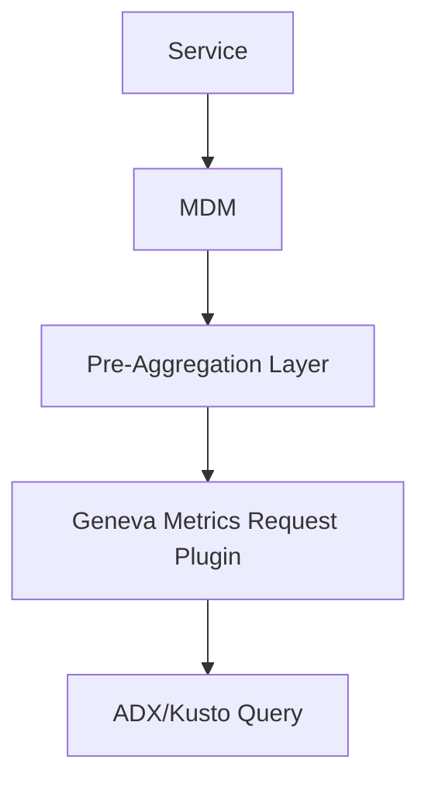
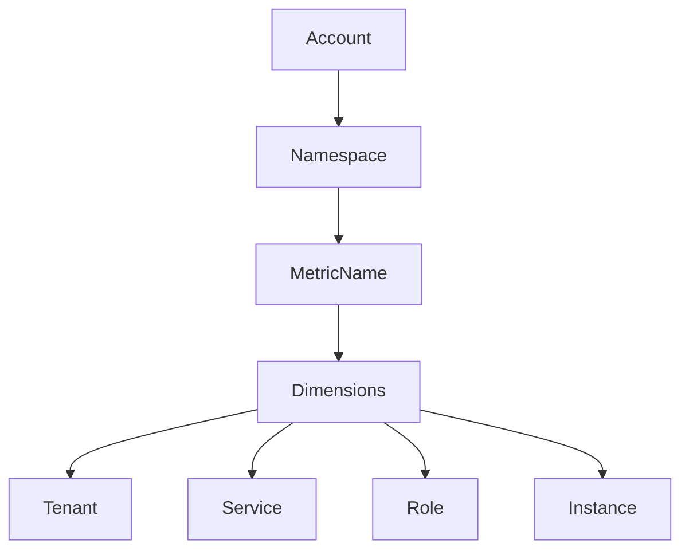
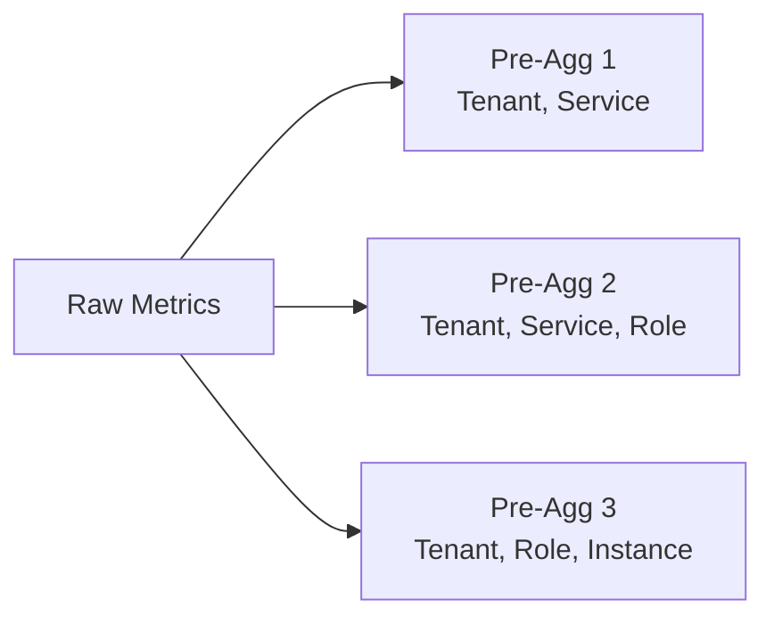

# Purpose

Guide for querying metrics data using the geneva_metrics_request plugin in Azure Data Explorer (ADX). This document starts with generic information covering MDM metric structure, pre-aggregation, and query patterns that apply to any service using MDM metrics. The final section contains LSA-specific metrics schema, dimensions, and specialized query patterns for Log Search Alerts service monitoring and investigation.

# System Architecture



# Metric Structure

## Component Hierarchy



## Core Components

- **AccountName**: Top-level metric grouping
- **Namespace**: Logical metric category
- **MetricName**: Specific measurement
- **Dimensions**: Key-value context pairs (commonly includes Tenant, Service, Role, Instance but may include additional dimensions depending on the metric)
- **Value**: Actual measurement

Note: While Tenant, Service, Role, and Instance are common dimensions in {mdmAccount} metrics, different metrics may expose additional dimensions based on their specific needs.

## Time Series

Unique combination of:

```
AccountName: LogSearchRule
Namespace: LogSearchRule
MetricName: Request Duration Ms
Dimensions:
  - Environment: "Prod"
  - BusinessFlow: "Log Search Alerts"
  - RequestName: "kusto-execute-search"
```

# Pre-aggregation Rules

## Overview

- Defines stored/collected dimension combinations
- Critical for query performance
- Limits available dimensions

## Example Configuration



## Sampling Types

Default available:

- Count
- Sum
- Average

Optional (metric-specific):

- Min
- Max

# Choosing the Right Sampling Type

## Critical Knowledge: Sampling Type Selection

**⚠️ Common Mistake**: Using Count when you need Sum or Average

Each metric provides multiple sampling types, and choosing the wrong one leads to incorrect analysis:

### Count
- **What it measures**: How many times a metric event was logged
- **Use for**: Metric heartbeat checks, verifying metric activity, debugging missing metrics
- **Example**: Checking if request-duration-ms metric is being emitted

### Sum  
- **What it measures**: Total aggregate of all metric values
- **Use for**: Counter metrics, when you need the cumulative total
- **Example**: amount-of-apples-sold → use Sum to get total apples sold

### Average
- **What it measures**: Mean value across all measurements
- **Use for**: Duration/latency metrics, resource utilization percentages
- **Example**: request-duration-ms → use Average to get mean response time

### Min/Max
- **What it measures**: Boundary values in the time window
- **Use for**: Performance bounds analysis, outlier detection, capacity planning

# Query Guide

## KQL Query Best Practices

### Query Structure

- No variables inside KQL-M query string (the inner query passed to geneva_metrics_request)
- Use inline values for filters
- Keep time ranges focused on relevant period
- No filtering on sampling type values (Count, Sum, etc.) inside the plugin - apply these filters outside the plugin
- aggregations

Example - ❌ Don't:

```kql
let tenant = 'xxx';  // Variables used inside
evaluate geneva_metrics_request(
    'Account1',
    ```
    ...| where Tenant == tenant
    ```,
    ago(30d),  // Too broad
    now()
)
```

Example - ✅ Do:

```kql
evaluate geneva_metrics_request(
    'Account1',
    ```
    ...| where Tenant == 'xxx'  // Inline value
    ```,
    datetime(2025-04-04),  // Focused range
    datetime(2025-04-05)
)
```

## Basic Syntax

```kql
evaluate geneva_metrics_request(
    'AccountName',
    ```
    metricNamespace("namespace")
    .metric("metricName")
    .dimensions("dim1", "dim2")
    .samplingTypes("Count", "Sum")
    | where dim1 == 'value1'
    ```,
    datetime(2025-04-04),
    datetime(2025-04-05)
)
```

## Required Parameters

1. Account Name (string)
2. MDM Query (string)
3. Start Time (datetime)
4. End Time (datetime)

## Result Structure

- TimestampUtc (1-minute default bins)
- Dimension columns
- Sampling type values
  - Default naming (without zoom):
    - Values are returned with the exact sampling type name: "Count", "Sum", "Average", "Min", "Max"
    - Example: When using samplingTypes("Sum", "Count"), columns will be "Sum" and "Count"
  - Naming with zoom operator:
    - Values are named according to the zoom assignment
    - Format: {AliasName} = {AggFunction}({SamplingType})
    - Example: `zoom TotalSum = Sum(Sum) by 1h` creates column "TotalSum"
    - If no alias provided, uses auto-generated name combining function and sampling type

# Best Practices

## Query Approach

1. **Hierarchical Query Pattern**

   ```kql
   // First: high-level view
   evaluate geneva_metrics_request(
       'Account1',
       ```
       metricNamespace("ns").metric("metric1")
       .dimensions("Tenant", "Service")
       .samplingTypes("Count")
       ```,
       ago(1h),
       now()
   )

   // Then: drill down
   evaluate geneva_metrics_request(
       'Account1',
       ```
       metricNamespace("ns").metric("metric1")
       .dimensions("Tenant", "Service", "Role", "Instance")
       .samplingTypes("Count")
       | where Tenant == 'tenant1'
       | where Service == 'service1'
       ```,
       ago(1h),
       now()
   )
   ```

## Filtering Inactive Series

When querying metrics, it's crucial to filter out inactive time series to:

- Reduce query result size
- Focus on relevant data points
- Improve query performance

Always include the "Count" sampling type alongside your primary metric:

```kql
// ❌ Don't: Query without filtering inactive series
evaluate geneva_metrics_request(
    'Account1',
    ```
    metricNamespace("ns").metric("metric1")
    .dimensions("Tenant", "Role")
    .samplingTypes("Sum")
    ```,
    ago(1h),
    now()
)

// ✅ Do: Include Count and filter active series
evaluate geneva_metrics_request(
    'Account1',
    ```
    metricNamespace("ns").metric("metric1")
    .dimensions("Tenant", "Role")
    .samplingTypes("Sum", "Count")  // Include Count
    ```,
    ago(1h),
    now()
)
| where Count > 0  // Filter inactive series
```

## Time Series Result Management

### Zoom Operator Usage

1. **ALWAYS** use the zoom operator when:
   - Querying time ranges ≥ 1 hour
   - Checking for error conditions or exceptions
   - Analyzing patterns over time

2. **Zoom Patterns by Query Type**:
   - Error metrics: `zoom ErrorCount = Sum(Count) by 1h`
   - Performance metrics: `zoom AvgValue = Avg(Average) by {appropriate bin}`
   - Health checks: `zoom MaxValue = Max(Max) by {appropriate bin}`

3. **Pre-Aggregate Before Filtering**:

   ```kql
   // ❌ Don't: Filter without aggregation
   ...| where Count > 0
   | summarize by Dimension
   
   // ✅ Do: Use zoom to pre-aggregate
   ...| zoom AggCount = Sum(Count) by 1h
   | where AggCount > 0
   ```

### Zoom vs Summarize: Understanding the Difference

The zoom operator and summarize operator serve different purposes and cannot be used interchangeably:

**Zoom Operator:**
- **Purpose**: Changes time series bucketing (TimestampUtc bins) only
- **Does NOT**: Change dimension aggregations
- **Use case**: Aggregate time buckets from 1-minute default to larger intervals (5m, 1h, etc.)

**Summarize Operator:**
- **Purpose**: Changes dimension aggregations only
- **Does NOT**: Change TimestampUtc bins
- **Use case**: Aggregate across dimensions (e.g., roll up from per-instance to per-tenant)

**Example showing both operators:**

```kql
evaluate geneva_metrics_request(
    'Account1',
    ```
    metricNamespace("ns").metric("metric1")
    .dimensions("Tenant", "Role")
    .samplingTypes("Sum", "Count")  // Include Count
   // Change the 1 minute bin to 5 minute - use zoom
   | zoom Sum = sum(Sum), Count = sum(Count) by 5m
  // Change the dimensions aggregations - use summarize to take only Tenant
  | summarize Sum = sum(Sum), Count = sum(Count) by Tenant
    ```,
    ago(1h),
    now()
)
// Here we can do regular KQL on the table which has: TimestampUtc, Tenant, Sum, Count
| where Count > 0  // Filter inactive series
```

### Plugin Query Limitations

**Critical Limitation**: Sampling type values (Count, Sum, Average, etc.) are stored as arrays within the plugin and cannot be filtered directly.

**❌ Invalid - Cannot filter on sampling types inside the plugin:**

```kql
evaluate geneva_metrics_request(
    'Account1',
    ```
    metricNamespace("ns").metric("metric1")
    .dimensions("Tenant", "Role")
    .samplingTypes("Sum", "Count")
    | where Count > 0  // ❌ INVALID - Count is an array here
    ```,
    ago(1h),
    now()
)
```

**✅ Correct - Apply sampling type filters outside the plugin:**

```kql
evaluate geneva_metrics_request(
    'Account1',
    ```
    metricNamespace("ns").metric("metric1")
    .dimensions("Tenant", "Role")
    .samplingTypes("Sum", "Count")  // No filtering inside plugin
    ```,
    ago(1h),
    now()
)
| where Count > 0  // ✅ CORRECT - Filter after plugin execution
```

**Why this limitation exists:**
- Inside the plugin, sampling types are arrays of values across time buckets
- Only after the plugin executes are these arrays converted to individual columns
- All filtering on sampling type values must happen in the outer KQL query

### Result Set Management

1. **Always estimate result cardinality**:
   - Consider: Time range × Dimensions × Sampling interval
   - Example: 24h × 100 partitions × 60 samples/hour = 144,000 rows!

2. **Prevention Strategies**:
   - Use appropriate time bins via zoom
   - Aggregate before filtering
   - Apply dimension filters early
   - Consider using top-N patterns

### Result Set Optimization Techniques

When your query hits limit use these techniques to optimize your investigation:

1. **Adjust bin size**: Increase the time granularity to reduce data points

   ```kql
   // Instead of
   | zoom Count = Sum(Count) by 1h
   
   
   // Try
   | zoom Count = Sum(Count) by 4h  // Larger bin size
   
   ```

2. **Remove dimensions**: Elevate to higher scope by removing granular groupings

   ```kql
   // Instead of
   | summarize Count = count() by Tenant, Role, PartitionId
   
   
   // Try removing a dimension
   | summarize Count = count() by Tenant, Role
   
   ```

3. **Progressive drill-down**: First identify hotspots at higher scope, then drill down

   ```kql
   // Step 1: Find problematic Roles
   | summarize ErrorCount = sum(Errors) by Role
   | order by ErrorCount desc
   
   
   // Step 2: For identified Role, drill down to partitions
   | where Role == "ProblemRoleIdentified"
   | summarize ErrorCount = sum(Errors) by PartitionId
   | order by ErrorCount desc
   
   ```

This iterative approach allows you to first identify the highest-impact areas before investigating specific details.

## Performance Tips

- Query only needed dimensions
- Use appropriate time ranges
- Filter early in the query
- Follow time binning rules

## Custom Time Bins

```kql
evaluate geneva_metrics_request(
    'MetricTeamInternalMetrics',
    ```
    metricNamespace("Metrics.Server")
    .metric("RequestCount")
    .dimensions("Datacenter")
    .samplingTypes("Sum")
    | zoom TotalSum = Sum(Sum) by 1d
    ```,
    datetime(2025-04-04),
    datetime(2025-04-05)
)
```

# Common Issues

## Query Failures

1. Missing dimensions in pre-aggregation
2. Time series limit exceeded
3. Invalid filter syntax
4. Reference variable in filter
5. Column resolution errors

### Column Resolution Troubleshooting

If a geneva_metrics_request query fails with column resolution errors (e.g., "Failed to resolve column 'Average'"), it often means the plugin returned no data. To debug:

1. Use `take 10` in the plugin query to see what data exists
2. Check actual column names and data patterns
3. Fix filters based on observed patterns

Example debugging process:

```kql
evaluate geneva_metrics_request(
    '{mdmAccount}',
    ```
    metricNamespace("AMBackend-SF").metric(@"\Memory\Available Bytes")
    .dimensions("ClusterName", "RoleInstance")
    .samplingTypes("Min", "Count")
    | take 10
    ```,
    ago(1h),
    now()
)
```

This approach helps identify:

- Which columns actually exist in the data
- What dimension values are available
- Whether the metric namespace and metric name are correct

## Zero Counts

- Usually indicates inactive instance
- Check instance lifecycle
- Verify dimension values

## Time Bins

- Default: 1 minute
- Custom via `zoom` operator
- Follow the binning rules according to the table below
  - Example: if the time range is above 12 hours windows, then use `zoom` of 1h bin.

# Quick Reference

## Time Binning

| Range | Bin Size |
|-------|----------|
| < 1h  | 1m |
| < 3h  | 5m |
| < 12h | 15m |
| ≥ 12h | 1h |

## Sampling Types

- Count: occurrences
- Sum: total
- Average: mean
- Min/Max: bounds

## Important Limits

- Max time series
- Pre-aggregation only
- Filter restrictions
- Time range caps

# LSA-Specific Metrics Schema and Queries

## Prerequisites

Before using LSA metrics, ensure you have read the generic sections above for fundamental concepts about MDM metrics structure, pre-aggregation, sampling types, and query patterns.

## LSA Metrics Overview

LSA uses MDM (Metrics Data Management) metrics for performance monitoring and health assessment. These metrics are queried using the `geneva_metrics_request` plugin with specific LSA dimensions and sampling types.

## Primary LSA Metrics

### 1. Request Duration Ms

**Purpose**: Measures duration of LSA service processors/operations

**Key Dimensions**:
- **BusinessFlow**: Must be "Log Search Alerts" for LSA service
- **RequestName**: Similar to `operation_Name` in logs (e.g., "kusto-execute-search", "lsa-alerts-activation")
- **Success**: Boolean dimension ("true"/"False") for success rate calculations
- **Environment**: Deployment environment (e.g., "Prod", "PPE")
- **Location**: Regional deployment location (e.g., "westeurope", "eastus2")

**Available Sampling Types**:
- **Count**: Number of request occurrences
- **Sum**: Total duration across all requests
- **Average**: Mean request duration
- **Min/Max**: Boundary durations

### 2. Remote Dependency Duration Ms

**Purpose**: Measures duration of external dependency calls (Azure Storage, Kusto, etc.)

**Key Dimensions**:
- **BusinessFlow**: Must be "Log Search Alerts" for LSA service
- **Name**: Dependency name (e.g., Azure Table Storage, Azure Queue Storage, Kusto)
- **ResultCode**: HTTP-like result codes (2xx for success, 5xx for errors)
- **Environment**: Deployment environment
- **Location**: Regional deployment location

**Available Sampling Types**:
- **Count**: Number of dependency calls
- **Sum**: Total duration across all calls
- **Average**: Mean dependency call duration
- **Min/Max**: Boundary durations

## LSA Metrics Query Patterns

### 1. LSA Request Success Rate Analysis

```kql
// LSA request success rate by region and operation
evaluate geneva_metrics_request(
    'LogSearchRule',
    ```
    metricNamespace("LogSearchRule")
    .metric("Request Duration Ms")
    .dimensions("BusinessFlow", "Environment", "Location", "RequestName", "Success")
    .samplingTypes("Count")
    | where BusinessFlow == "Log Search Alerts"
    | where Location in~ ("westeurope", "eastus2")
    | zoom TotalCount = Sum(Count) by 10m
    ```,
    ago(4h),
    now()
)
| join kind=leftouter (
    evaluate geneva_metrics_request(
        'LogSearchRule',
        ```
        metricNamespace("LogSearchRule")
        .metric("Request Duration Ms")
        .dimensions("BusinessFlow", "Environment", "Location", "RequestName", "Success")
        .samplingTypes("Count")
        | where BusinessFlow == "Log Search Alerts"
        | where Location in~ ("westeurope", "eastus2")
        | where Success == "true"
        | zoom SuccessfulCount = Sum(Count) by 10m
        ```,
        ago(4h),
        now()
    )
) on TimestampUtc, Environment, Location, RequestName
| extend SuccessRate = round(SuccessfulCount * 100.0 / TotalCount, 2)
| where SuccessRate < 99.9  // Focus on degraded operations
| project TimestampUtc, Environment, Location, RequestName, SuccessRate, TotalCount, SuccessfulCount
```

### 2. LSA Request Performance Analysis

```kql
// LSA request performance by operation and region
evaluate geneva_metrics_request(
    'LogSearchRule',
    ```
    metricNamespace("LogSearchRule")
    .metric("Request Duration Ms")
    .dimensions("BusinessFlow", "Environment", "Location", "RequestName")
    .samplingTypes("Count", "Average", "Sum")
    | where BusinessFlow == "Log Search Alerts"
    | where Location in~ ("westeurope", "eastus2")
    | zoom RequestCount = Sum(Count), AvgDuration = Avg(Average), TotalDuration = Sum(Sum) by 10m
    ```,
    ago(4h),
    now()
)
| where RequestCount > 0
| extend P95Duration = TotalDuration / RequestCount  // Approximation
| project TimestampUtc, Environment, Location, RequestName, RequestCount, AvgDuration, P95Duration
| order by AvgDuration desc
```

### 3. LSA Dependency Health Monitoring

```kql
// LSA dependency success rate and performance
evaluate geneva_metrics_request(
    'LogSearchRule',
    ```
    metricNamespace("LogSearchRule")
    .metric("Remote Dependency Duration Ms")
    .dimensions("BusinessFlow", "Environment", "Location", "Name", "ResultCode")
    .samplingTypes("Count", "Average")
    | where BusinessFlow == "Log Search Alerts"
    | where Location in~ ("westeurope", "eastus2")
    | zoom CallCount = Sum(Count), AvgDuration = Avg(Average) by 10m
    ```,
    ago(4h),
    now()
)
| where CallCount > 0
| extend IsSuccess = case(
    ResultCode startswith "2", "Success",
    ResultCode startswith "5", "ServerError",
    ResultCode startswith "4", "ClientError",
    "Unknown"
)
| summarize 
    TotalCalls = sum(CallCount),
    SuccessfulCalls = sumif(CallCount, IsSuccess == "Success"),
    AvgDuration = avg(AvgDuration)
    by TimestampUtc, Environment, Location, Name
| extend SuccessRate = round(SuccessfulCalls * 100.0 / TotalCalls, 2)
| where SuccessRate < 99.5  // Focus on degraded dependencies
| project TimestampUtc, Environment, Location, Name, SuccessRate, TotalCalls, AvgDuration
```

### 4. LSA Regional Performance Comparison

```kql
// Compare LSA performance across regions
evaluate geneva_metrics_request(
    'LogSearchRule',
    ```
    metricNamespace("LogSearchRule")
    .metric("Request Duration Ms")
    .dimensions("BusinessFlow", "Environment", "Location", "RequestName", "Success")
    .samplingTypes("Count", "Average")
    | where BusinessFlow == "Log Search Alerts"
    | where RequestName == "kusto-execute-search"
    | zoom RequestCount = Sum(Count), AvgDuration = Avg(Average) by 1h
    ```,
    ago(24h),
    now()
)
| where RequestCount > 0
| summarize 
    TotalRequests = sum(RequestCount),
    OverallAvgDuration = avg(AvgDuration),
    SuccessfulRequests = sumif(RequestCount, Success == "true")
    by Location, Environment
| extend SuccessRate = round(SuccessfulRequests * 100.0 / TotalRequests, 2)
| project Location, Environment, TotalRequests, SuccessRate, OverallAvgDuration
| order by SuccessRate asc, OverallAvgDuration desc
```

### 5. LSA Error Rate Monitoring

```kql
// Monitor LSA error rates with zoom aggregation
evaluate geneva_metrics_request(
    'LogSearchRule',
    ```
    metricNamespace("LogSearchRule")
    .metric("Request Duration Ms")
    .dimensions("BusinessFlow", "Environment", "Location", "RequestName", "Success")
    .samplingTypes("Count")
    | where BusinessFlow == "Log Search Alerts"
    | where Location in~ ("westeurope")
    | zoom TotalCount = Sum(Count) by 10m
    ```,
    ago(4h),
    now()
)
| join kind=leftouter (
    evaluate geneva_metrics_request(
        'LogSearchRule',
        ```
        metricNamespace("LogSearchRule")
        .metric("Request Duration Ms")
        .dimensions("BusinessFlow", "Environment", "Location", "RequestName", "Success")
        .samplingTypes("Count")
        | where BusinessFlow == "Log Search Alerts"
        | where Location in~ ("westeurope")
        | where Success == "true"
        | zoom SuccessfulCount = Sum(Count) by 10m
        ```,
        ago(4h),
        now()
    )
) on TimestampUtc, Environment, Location, RequestName
| extend 
    SuccessfulCount = coalesce(SuccessfulCount, 0),
    FailedCount = TotalCount - SuccessfulCount,
    ErrorRate = round((TotalCount - SuccessfulCount) * 100.0 / TotalCount, 2)
| where ErrorRate > 0.1  // Focus on operations with >0.1% error rate
| project TimestampUtc, Environment, Location, RequestName, ErrorRate, FailedCount, TotalCount
| order by ErrorRate desc
```

## LSA Metrics Best Practices

### 1. Always Filter by BusinessFlow

```kql
// ✅ Correct: Always filter by LSA BusinessFlow
| where BusinessFlow == "Log Search Alerts"

// ❌ Incorrect: Missing BusinessFlow filter will include other services
```

### 2. Regional Scoping

```kql
// ✅ Correct: Scope to specific regions
| where Location in~ ("westeurope", "eastus2")

// ✅ Correct: Single region analysis
| where Location == "westeurope"
```

### 3. Use Appropriate Sampling Types

```kql
// ✅ For success rate calculations: Use Count
.samplingTypes("Count")

// ✅ For performance analysis: Use Count + Average
.samplingTypes("Count", "Average")

// ✅ For detailed analysis: Use Count + Average + Sum
.samplingTypes("Count", "Average", "Sum")
```

### 4. Time Binning with Zoom

```kql
// ✅ For 4-hour analysis: Use 10-minute bins
| zoom TotalCount = Sum(Count) by 10m

// ✅ For 24-hour analysis: Use 1-hour bins
| zoom TotalCount = Sum(Count) by 1h
```

### 5. Filter Inactive Series

```kql
// ✅ Always filter out inactive time series
| where Count > 0
// or after zoom aggregation:
| where TotalCount > 0
```

## LSA Metrics Correlation with Logs

Use metrics and logs together for comprehensive analysis:

1. **Start with metrics** to identify performance degradation or error rate spikes
2. **Use logs** to investigate root causes of issues identified in metrics
3. **Correlate timestamps** between metrics bins and log entries
4. **Map RequestName** (metrics) to `operation_Name` (logs) for detailed analysis

Example correlation workflow:

```kql
// Step 1: Identify problematic operations in metrics
// [Run LSA metrics query to find high error rates]

// Step 2: Correlate with logs for detailed analysis
lsa_requests
| where timestamp > ago(1h)
| where operation_Name == "kusto-execute-search"  // From metrics RequestName
| where success == "False"
| where location == "westeurope"  // From metrics Location
| take 10
```

## LSA Metrics Investigation Scenarios

### Performance Degradation Investigation

1. **Identify slow operations** using Request Duration Ms Average sampling
2. **Check dependency health** using Remote Dependency Duration Ms
3. **Compare regional performance** across Location dimension
4. **Correlate with logs** for detailed error analysis

### Error Rate Spike Investigation

1. **Monitor success rates** using Request Duration Ms Count sampling with Success dimension
2. **Identify failing dependencies** using Remote Dependency Duration Ms with ResultCode
3. **Regional impact analysis** using Location dimension
4. **Root cause analysis** using correlated log entries

### Capacity Planning

1. **Analyze request volumes** using Request Duration Ms Count sampling
2. **Monitor dependency load** using Remote Dependency Duration Ms Count
3. **Regional distribution** analysis using Location dimension
4. **Performance trend analysis** using zoom aggregation over longer periods
